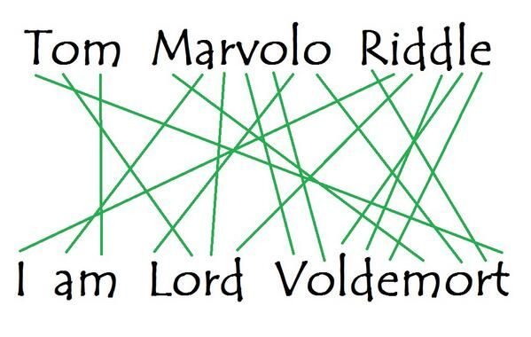

Given a one of these, find the other:

And without making a human sift through mountains of unpronouncible gibberish along the way.

### A Work in Progress

It doesn't work yet.  Try again later.

### But Why?

Because I think that working with SAT-solvers is:

 - [interesting](https://github.com/MatrixManAtYrService/efiL/blob/master/convolve.ipynb)
 - obnoxious

And I want to try my hand at an API that would make it less obnoxious.

### The Strategy

The naieve approach:

- Generate all permutations
- Filter out unpronouncable ones

But _most_ of them are going to be unpronouncable--so we're going to generate a lot of permutations that just get thrown away.  Instead I want a permutation-generator that is constraint aware--so that it never bothers with unpronouncable permutations in the first place.

Under the hood it should go something like this:

    from pycosat import itersolve
    from tomriddle import cnf

    constraints = cnf.permute("iamlordvoldemort")
    constraints.extend(cnf.pronounce())

    for solution in itersolve(constraints):
        print(solution)

[Pycosat](https://pypi.org/project/pycosat/) takes lists like this:

    [[1, 2, -3], [4, -5]]

They constrain the solver so that it only creates solutions for which expressions like this one is true:

    (A | B | ~C) & (D & ~E)

It's at least feasible because adding a constraint just requires that you concatenate the lists.  No fancy symbolic hyjinks necessar.  We'll see how well it works in practice.
